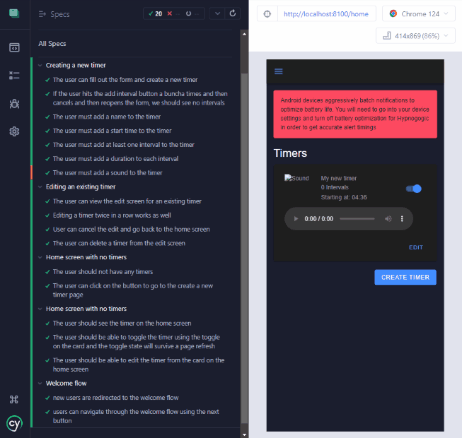

<h1 style="text-align:center">Hypnogogic</h1>
The hypnogogic state is the state of consciousness between wakefulness and sleep. It is a state of mind where you are most susceptible to suggestion and is used in chasing and acheiving out of body consciousness.

Hypnogogic is a mobile app designed to assist in maintaining the hypnogogic state. Users set a series of alarms that will go off at short intervals, holding them in the hypnogogic state.

## Development
### Getting Started
This is an ionic 7 app using capacitor 5 plugins as of writing it is only available on android. In order to develop, follow the ionic basic setup guide first: https://ionicframework.com/docs/v7/ and then the capacitor android environment setup: https://capacitorjs.com/docs/getting-started/environment-setup#android-requirements - you may want to read through the entire getting started docs for ionic and capacitor if you are new to the frameworks.

### Essential Commands
Once you have your environment set up you can clone this repo and start devving. In order to run the app locally you will need to install the dependencies:

```bash
npm install
```

Then in order to run the app in your web browser, you can use the ionic serve command:

```bash
ionic serve
```

If you want to run the app on a connected android device you will need to build the app and then run it using capacitor:

```bash
ionic build
ionic cap run android
```

### Testing
The app comes with cypress tests that run in the browser. To run these tests you will need to have the app running using `ionic serve` and make sure that the `baseUrl` in `cypress.config.js` is set to the url that ionic serve reports (it should be fine by default). Then run tests using:

```bash
npm run test:e2e
```

If you make any adjustments to the UI flow please make sure to run the cypress tests to ensure that the app is still functioning as expected, and update or write new tests to cover the new functionality.

Here's a gif of the most recent test run (update this image when you update the tests):



